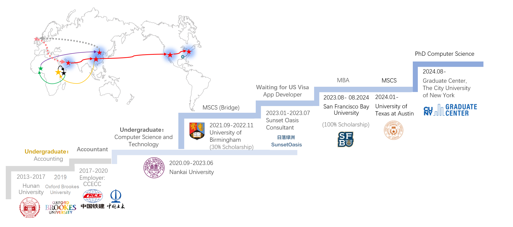

---

permalink: /story/
title: "Story"

author_profile: true
redirect_from: 
  - /about
---

  

    

      <nav id="site-nav" class="greedy-nav">
        <button>

</button>
        <ul class="visible-links">
          <li class="masthead__menu-item masthead__menu-item--lg masthead__menu-home-item"><a href="https://chufeng-jiang.github.io/story/">Life is Strange</a></li>
			<li class="masthead__menu-item"><a href="https://chufeng-jiang.github.io/story/dream">Dream Girl (Road to CS 2021)</a></li>
			<li class="masthead__menu-item"></li>
	        <li class="masthead__menu-item"><a href="https://chufeng-jiang.github.io/story/africa">Cast Away (Life in Africa 2017)</a></li>
			<li class="masthead__menu-item"></li>
	        <li class="masthead__menu-item"><a href="https://chufeng-jiang.github.io/story/nerd">At Dawn (The Nerd 2013)</a></li>
			<li class="masthead__menu-item"></li>

		</ul>
	    <ul class="hidden-links hidden"></ul>
	  </nav>
	

  








# Life is Strange

"This is not a detour; this is the path I took to get CUNY."

During my freshman year, I was a student majoring in Chemical Engineering and Technology. Of course, I didn't like chemistry; I was reassigned to the chemistry major. <i>(Reassignment means that I was admitted to the university, but my entrance exam scores didn't meet the requirements for my preferred major, so I was randomly assigned to a different department with available slots.)</i> And after the first year, I transferred to the Accounting major at my parents' request. Of course, Unfortunately, I didn't enjoy accounting either. I struggled to find my true interests.

In my final undergraduate year, I participated in the entrance exams for graduate school. I underestimated my performance, mistakenly believing my score wouldn't meet the requirements of my preferred school (actually, I did meet the requirements, but I lacked confidence before the school released the minimum passing score). My parents were very angry,  not only because I may fail on such an important exam, but also they thought me always goofing off without ideal and cannot live independently. So, they gave me ￥8000 Chinese Yuan (approximately $1140) and told me I had to support myself from then on, as they wouldn't provide any more financial assistance.

Initially, I thought they were just threatening me. But when the money ran out and my phone broke during a work trip for an audit, I asked them for more money, and they refused. That’s when I realized I had to fend for myself. I felt upset and borrowed money from friends and classmates to cover my daily expenses. By the time I graduated, I knew I couldn't repay them because salaries in China were too low. Desperate, I decided to join China’s Foreign Infrastructure Aid Projects in Africa, which offered at least three times the salary I would earn in China.

My first work was in Ethiopia, where I worked as a junior accountant for the Kombolcha-Bati-Mille Upgrade Project. Then I went to Kenya, working as an accountant and tax specialist for the Karen Waterfront Shopping Mall Project and Kakamega County General Hospital Project. After gaining comprehensive training in various roles, I joined the China Civil Engineering Construction Corporation Nigeria Limited, where I primarily worked on the Lagos-Ibadan Railway project, along with the Abuja Airport Project and various logistics and real estate projects in Abuja. I stayed in Abeokuta for almost three years, progressing from accountant to assistant financial manager.

