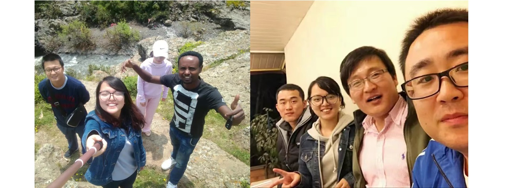

---

permalink: /story/africa/
title: "Story"

author_profile: true
redirect_from: 
  - /about
---









# Life in Africa 2017 - 2020

"Nothing's ever for sure, John. That's the only sure thing I do know." ——by A Beautiful Mind.

Life in Africa was far more challenging than I had anticipated. 

The first country I went to was Ethiopia, a nation known for its high-altitude terrain. During my first two weeks there, I suffered from severe altitude sickness, which made adjusting even more difficult. I worked as a junior accountant, responsible for managing cash and overseeing daily financial transactions for the company and various construction sites.

It was during that time that Mr. Gajo and the local staff gave me the English name I use today: Beza. This is a common Ethiopian name that carries deep meaning—"a gift from God" or "medicine from heaven." Years later, while studying at San Francisco Bay University, my classmates shared that "Beza" also holds the meaning of "good luck" in certain contexts, further enriching its significance to me.

     <i>With some of my collegues in Ethiopia, 2017</i> 

I stayed for three months before moving to Kenya for another project, where I worked as a tax specialist and accountant. Kenya is a stunning country, blessed with abundant natural scenery and vibrant flowers. During my time there, the jacaranda trees were in full bloom, and their beauty left a lasting impression—it was my first time seeing such magnificent blossoms. I explored much of Nairobi on foot, and I found life there to be incredibly peaceful. The people were friendly, the weather was pleasant, and my colleagues were wonderful to work with.

     <i>Jacaranda blossoms, and I visited the Giraffe Centre in Kenya, 2017</i> 

After completing the year-end audit at the company in Kenya, I moved to Nigeria, where I stayed for nearly three years. 

Initially, I was assigned to Abuja to handle international accounting affairs. In my second month there, I contracted malaria and experienced a high fever of nearly 40°C. Thanks to the attentive care of Mrs. Yafei and Dr. Deng, I recovered quickly and regained my health.

     <i>CCECC NG Abuja, Nigeria, 2018</i> 

Later, I was reassigned to the Lagos-Ibadan Project, which had just started. I remained with that project for most of my 3 years in Nigeria, progressing from a junior position to a senior role.

The early days in Nigeria were quite uneventful. The project site was located in a very rural village, and for safety reasons, I wasn’t allowed to leave without permission. Most of my time was spent at the camp, waiting for third parties and construction managers to approach me with financial matters. Occasionally, I visited the construction site for audits and inspections to review progress and estimate project costs.

     <i>CCECC NG Ogun, Nigeria, 2020</i> 

These three years were invaluable for my professional growth. I became well-versed in all aspects of accounting, from basic journal entries and financial reporting to negotiating with stakeholders to recover funds and maintain cash flow throughout the project's progress.

Time flew by, and as my employment came to an end, I realized I had achieved what I set out to accomplish. With that sense of fulfillment, I returned to China to explore new opportunities and consider a different path in life. 