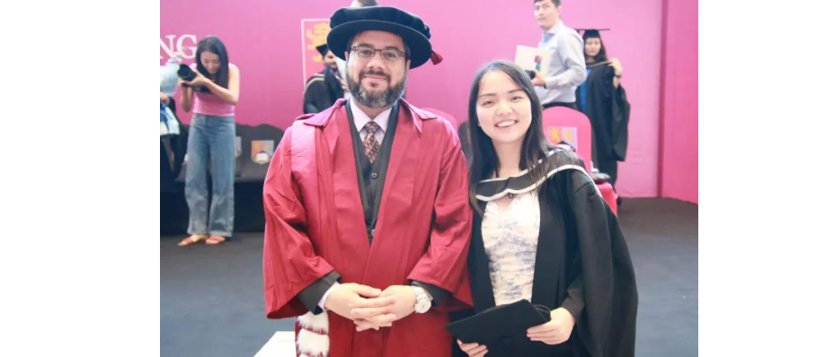

---

permalink: /story/dream/
title: "Story"

author_profile: true
redirect_from: 
  - /about
---









# Dream Girl

"When there was nothing to believe in, she believed in herself."

I prefer not to focus on the reasons why I transitioned to Computer Science. Life had its ups and downs, but I’m committed to taking responsibility for my choices and following through with my plans for the future.

After my journey in Africa, I enrolled in an online Second Bachelor’s program in Computer Science at Nankai University. This program helped me build a strong foundation in the field. Interestingly, it took longer to complete than my Bridge Master’s degree in Computer Science, so I earned my Master’s degree first. Initially, I planned to use the bachelor’s courses to fulfill prerequisites for a master’s program in Canada. However, my plans evolved. I found the courses both enjoyable and affordable, so I decided to complete the program step by step.

While I initially intended to move to Canada, I instead chose Dubai as a transitional phase to rethink and plan my future. In Dubai, I joined bridge courses in Computer Science at the University of Birmingham’s Dubai campus, where I was awarded up to a 40% tuition scholarship. The faculty there had a profound influence on my interest in the field. I began by learning the fundamentals of Object-Oriented Programming (OOP) in Java and progressed to building a web application project using Spring Boot. Although the application didn’t fully separate the front-end and back-end, I designed and implemented it independently from scratch. This experience significantly boosted my confidence in my ability to excel in Computer Science.

At the University of Birmingham's Dubai campus, I was fortunate to have Dr. Mian designated as my personal tutor. He also served as my course lecturer for subjects such as Computer Systems, Algorithms, and Databases. Dr. Mian was an exceptional educator, delivering highly engaging and well-structured courses. He was patient in guiding us as new conversion students and always approachable, offering support not only in academics but also in adjusting to life in Dubai. Despite my limited background and relatively short experience in Computer Science, he encouraged me to pursue my dream of excelling in the field. Dr. Mian believed in my potential and gave me the confidence to aim higher. With his encouragement, I made the decision to come to the United States to pursue a PhD in Computer Science.

     <i>Dr. Mian and Me, 2021</i> 

 Unfortunately, I was denied a U.S. F-1 visa twice at the beginning of 2023. During this time, I stayed home and co-founded an IT consulting business with two partners. However, as time passed, I realized I still deeply wanted to experience life in the U.S. Determined, I applied for an MBA program at San Francisco Bay University. The university offered me a full scholarship and an additional eight-month housing scholarship. With this generous support, I was finally able to secure my visa.

I moved to Silicon Valley to pursue my MBA studies. The students there were incredibly supportive, and we often collaborated on business simulations to learn about operations, economics, and strategy. 

     <i>Dr. Flora is helping my group identify the financial report issues, 2024</i> 

 This immersive experience reignited my passion for the tech industry. With my multidisciplinary background, my desire to delve deeper into computer science became even stronger. Motivated by this newfound clarity, I decided to challenge myself further and applied for a Ph.D. program in Computer Science.

During my application and interview process, I was fortunate to receive invaluable advice and guidance from various professors. Their insights not only helped me navigate the complexities of the application journey but also shaped my strategy for selecting research areas and universities that aligned with my interests. Despite the challenges, the unwavering support I received kept me motivated and focused. Over time, my efforts paid off, culminating in a positive response from CUNY for my PhD application—a pivotal moment in my academic journey.

Completing my MBA program in just 12 months was a significant milestone that not only equipped me with essential business acumen but also reignited my passion for computer science—the field where my true interests lie. During this time, I also received valuable guidance from computer science scholars who helped me meet the rigorous standards for a NIW application, providing me with the flexibility to explore areas in computer science that align with my interests and aspirations.

Motivated by my accomplishments and the unwavering support of my friends and mentors, particularly **Dr. Raffi Khatchadourian**, who is now my PhD advisor, I transitioned to the next phase of my academic journey with renewed determination and a clear vision for the future. This synergy between my interdisciplinary background and my passion for computer science has fueled my drive to make meaningful contributions to the field.
