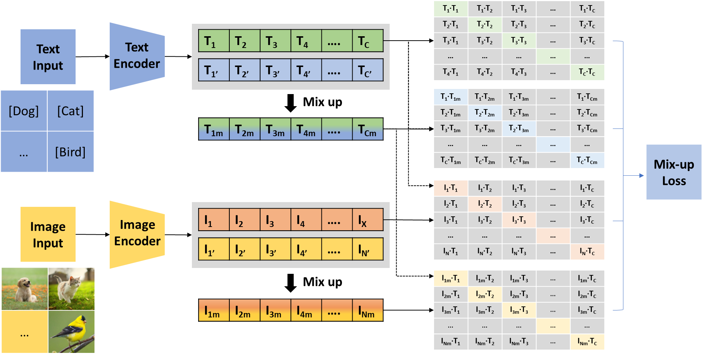
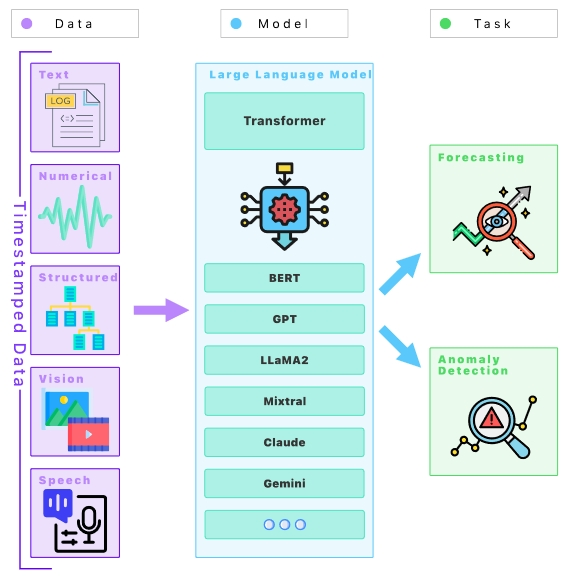

# 📝 Selected Publications 

	

		

			
AIEA 2024

			
		

	

	

[Mixup-CLIPood: Robust Domain Generalization for Multi-modal Object Recognition](https://github.com/Yuxin_Qiao/NewCLIPood) \\
Yuxin Qiao, Keqin Li, Junhong Lin, Rong Wei, **<u>Chufeng Jiang</u>**, Yang Luo, Haoyu Yang.

- [**Contribution**](https://github.com/Yuxin_Qiao/NewCLIPood) <strong></strong>
  - address the incongruity between the actual loss and the one documented, and we deduce the actual loss used.
  - expand the experiments to encompass two larger vision-language backbones.
  - propose *Mixup-CLIPood* with a novel mix-up loss to enhance the previous model's generalization ability. 

	

		

			
Arxiv 2024

			
		

	

	

[Large language models for forecasting and anomaly detection: A systematic literature review](https://arxiv.org/abs/2402.10350)  \\
Jing Su, **<u>Chufeng Jiang</u>**, Xin Jin, Yuxin Qiao, Tingsong Xiao, Hongda Ma, Rong Wei, Zhi Jing, Jiajun Xu, Junhong Lin

[**Research Questions**](https://arxiv.org/abs/2402.10350) <strong></strong>

- Q1: What methodologies are employed in LLMs for forecasting in different domains?
  - This question aims to explore and categorize the different methodologies and techniques used in LLMs for forecasting tasks, providing insights into their applicability across different sectors.
- Q2: How effective are LLMs in detecting anomalies compared to traditional anomaly detection methods?
  - This question seeks to evaluate the performance and accuracy of LLMs in identifying outliers or unusual patterns in data, contrasting their effectiveness with that of conventional anomaly detection techniques.
- Q3: What are the limitations and challenges of using LLMs for forecasting and anomaly detection?
  - This question intends to identify the current limitations, challenges, and potential areas of improvement in using LLMs for these purposes, including factors like data prerequisites, computational expenditures, and model interpretability.

**Academic Impact**: This paper is selected to present in a Collaborative Study and Research Group on LLM Literature [时序时空大模型读书会启动：大模型开启时序时空数据挖掘新视角](https://mp.weixin.qq.com/s?__biz=MzIzMjQyNzQ5MA==&mid=2247686949&idx=1&sn=7ac5abf22610981adf2404a7e687542d&chksm=e9174944e3bc883a8b1e14392e05e90ba75b9023d4237f594b139d1643aa3928c6191fe2dc24&scene=27).

