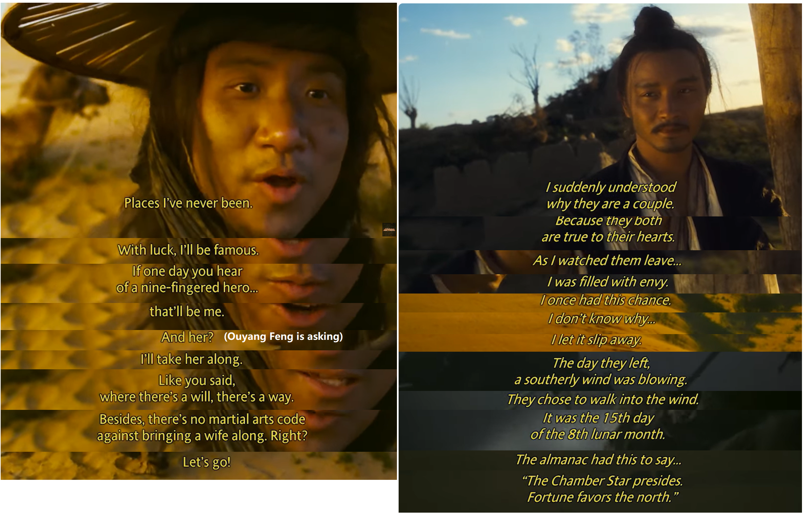
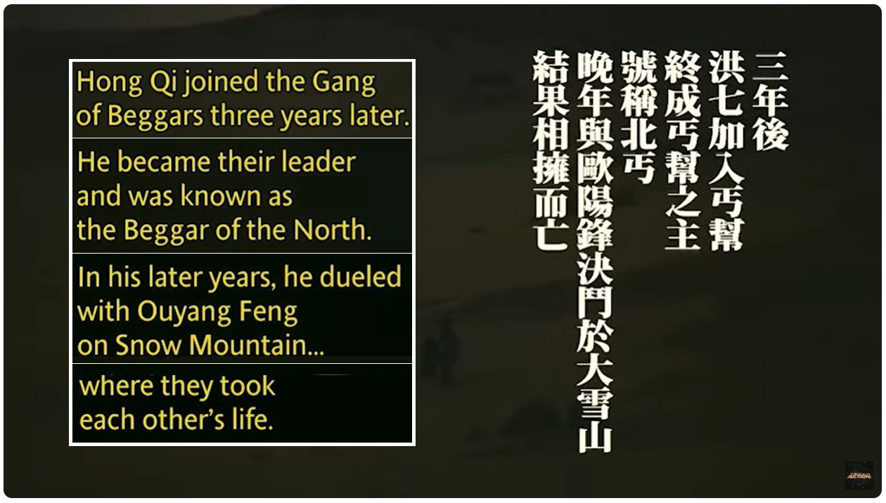

---

permalink: /movie/
title: "Ashes of Time"

author_profile: true
redirect_from: 
  - /about
---
<!-- -->








# Ashes of Time 《东邪西毒》

<!-- 

  <a href="https://www.linkedin.com/pulse/places-my-heart-acknowledgements-28th-aug-2024-chufeng-beza-jiang-ummse/" style="font-size: 16px; font-weight: bold;">PLACES IN MY HEART - ACKNOWLEDGEMENTS (28th Aug, 2024)</a>

 -->

> The original Chinese version of this page can be found in the latter half. 
> The Movie can be found at [Ashes of Time Redux | Full Movie | Piece Of The Action](https://www.youtube.com/watch?v=t0PTHlSCJl0)

This is my favorite movie. I like the The Northern Beggar **Hong Qigong** most. 

It feels like my personality and certain beliefs have been shaped not only by society but also by the characters portrayed in literary works, such as Hong Qi from this one, ***Ashes of Time***. 

Hong Qi is a straightforward and simple man, but in Wong Kar-wai’s (The Movie Director)  intricate world of martial arts, being simple can be an advantage. **If you're simple enough, you might just have the last laugh.**

Hong Qi knows exactly what he wants and goes straight for it. If he wants to kill someone, he doesn’t care if they’re male or female, strong or weak. Once his blade is drawn, blood will follow. He doesn’t care if he has shoes or not—he’s the kind of person who walks the martial world barefoot if he feels like it. He’s not bothered by the fact that shoeless swordsmen earn less money. He also doesn’t bother scouting out his enemies beforehand. To put it in modern terms, he’s like a reckless bull charging forward blindly. 

The Western Venom Viper **Ouyang Feng** bought him a pair of shoes, but Hong Qi eventually took them off and left them behind in the desert. A single egg from an orphan girl was enough to make him kill all the swordsmen at the Grand Marshal’s residence, even at the cost of losing a finger. 

Yet, even someone as simple as Hong Qi can get lost when facing Ouyang Feng.

Wearing shoes or not shows whether you have status. Preparing for a fight or not shows whether you’re just a mercenary or a true hero. When the village girl first came to beg Hong Qi to avenge her family, he refused because he knew Ouyang Feng wouldn’t approve. **Even the simplest and most straightforward person can change under someone else's influence. No matter how direct Hong Qi is, he still hesitates and wonders if there’s another way.**

In the end, though, he did help the village girl, even at the cost of losing a finger. He said, "***It wasn’t worth it, but it felt good—that’s who I truly am.***" In truth, the loss of that finger was worth it—it helped him rediscover his simplicity and directness.

<i>Hong Qi said,   "It's not worth it! But it felt good—that's who I truly am.I should've stayed out of it, but my blade isn't as sharp as it used to be. It was sharp because I was straightforward—I did what I thought was right without ever considering the cost. I thought I would always stay that way. But when that girl came to me for help, I realized I had changed. I didn’t agree to help her, not because I didn’t want to, but because I knew you wouldn’t approve.  That day, I was disappointed in myself. I felt like I had become one of you, like I had lost myself. I didn’t want to be like you, because I know Ouyang Feng would never risk his life for something as trivial as an egg. That’s the difference between you and me.” </i> 
  

Even without that finger, even without a blade, Hong Qi could still kill barehanded. After all, the martial world has no rules against roaming with your wife by your side. **The path is what you make of it.**

With his wife, he roamed the martial world, helping others while taking lives. He was no ordinary swordsman. It wasn’t about wearing shoes or not; **it was about living on his own terms—simple, direct, and free.** He chose his own path, one that stood apart from others, apart from the trends of the world.

<i>"If I believe it’s right, I’ll do it—without ever thinking about the cost."   ——Hong Qi</i> 
  

PS：I want to introduce another **excerpt** to you, which is unrelated to this movie, and I like it very much. You can find it at the end of the section titled 'The Nerd' on [https://chufeng-jiang.github.io/story/nerd/](https://chufeng-jiang.github.io/story/nerd/)

----------------------------------

 Original Version in Chinese:   

这是我最喜欢的电影，我最喜欢的人物是洪七。

我感觉我的个性和某些观念不仅受到了社会的影响，还被一些文学作品塑造出来的形象所影响，比如《东邪西毒》（英译《Ashes of time》）里的洪七。

洪七是一个简单直接的人，而王家卫墨镜之下看见的这个江湖太复杂，复杂到只要你足够简单，就可以笑到最后。

洪七简单，他想要什么，就直奔其去，他要杀人，也不管你是男是女人多势众，只要刀起便血溅。他不关心自己有没有鞋穿，闯荡江湖不想穿鞋就不穿鞋，才不管是不是穿鞋的刀客才能要更高的价钱。他也没打算事前刺探敌人的虚实，套用今天的话说，他是一个横冲直撞的盲牛。欧阳锋给他买的鞋最后他还是脱掉留在了沙漠，孤女的一个鸡蛋就让他杀尽太尉府的那群刀客，还丢了一根手指。

但这样简单的人到了欧阳锋面前还是迷失过。有鞋子和没鞋子的刀客身价是不一样的，这说明你有面子还是没面子；有刺探和没刺探的刀客是不一样的，这显示了你只是一个刀客还是一个大侠。在村姑初来恳求洪七帮忙复仇的时候，洪七没有答应，因为他知道欧阳锋不会答应。一个人受到他人的影响理所当然会改变，就算再简单直接，还是会揣测是不是有第二条路。

然而他最终帮了村姑，因此而失去了一个手指，他说“不值得，但是我觉得痛快，这才是我自己”。其实，这个手指当然丢得值得，他靠着这个找回了自己的简单和直接。

> 洪七说：  “不值得！但是我觉得痛快，这才是我自己。
>
> 本来我应该没事，但是我的刀没以前快。**我以前快是因为我直接，认为对就去做，从来不会想什么代价。**我以为我这一辈子都不会变，直到那个女孩来求我，我才发觉我完全变了，我竟然没有答应她，因为我知道你一定不会答应。
>
> 那天，我很失望，我觉得我已经和你混在一起，变成另一个人，没有了自己。我不想跟你一样，因为我知道你欧阳锋绝对不会为一个鸡蛋去冒险，这是我和你的区别。”

洪七丢了一根手指不能再用刀，但是赤手空拳也照样能杀人，江湖上也没有规矩说不准带着老婆闯荡江湖，事在人为。

他带着妻子闯荡江湖，他在杀人的同时帮人，他不是一个普通的刀客，这已和有没有鞋无关，而是他以自己简单直接想怎样就怎样的方式去闯，和别的刀客都不同，和潮流不同。

> “我觉得对我就会去做，从来没有想会不会有什么代价。”
>
> ​                               ——By 洪七

PS：我想向大家介绍另一个**摘录**，它与这部电影无关，但我很喜欢它，你可以在“书呆子”章节的末尾找到它：[https://chufeng-jiang.github.io/story/nerd/](https://chufeng-jiang.github.io/story/nerd/)

