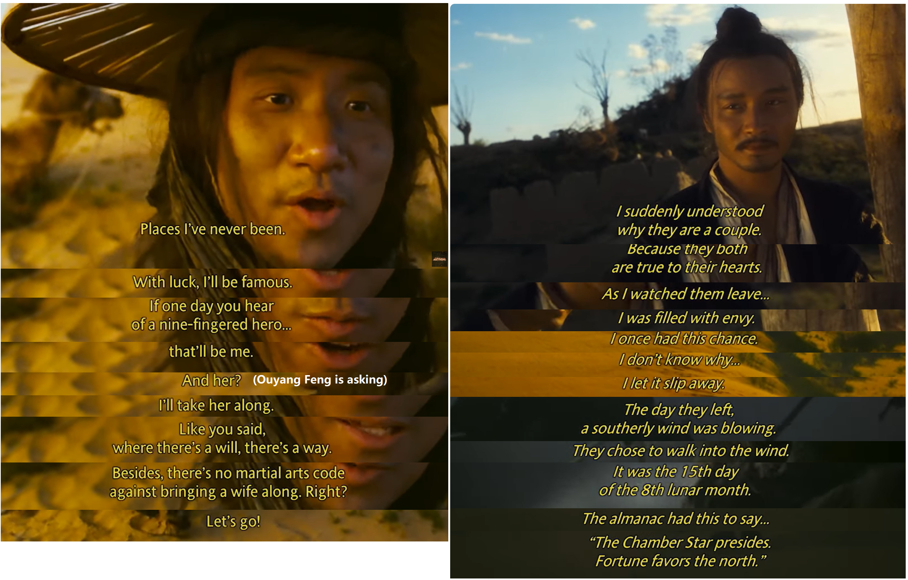
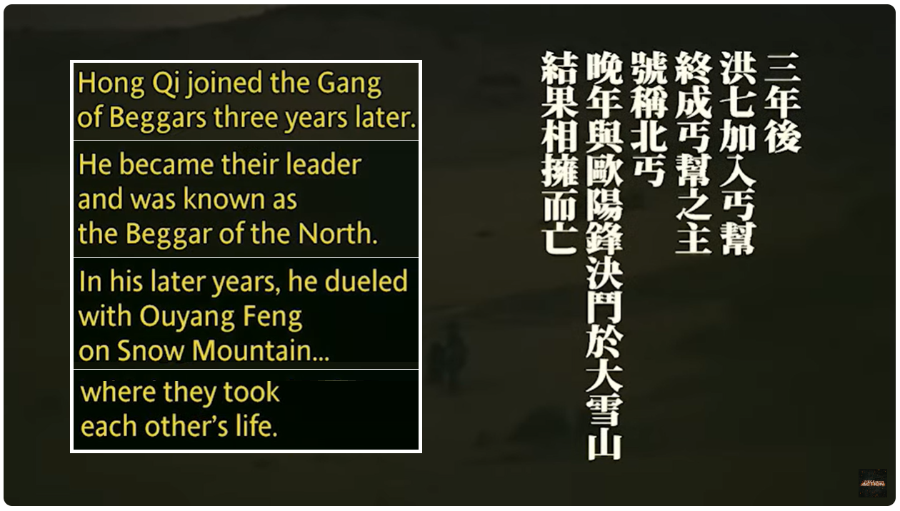

---

permalink: /movie/
title: "Ashes of Time"

author_profile: true
redirect_from: 
  - /about
---
<!-- -->








# Ashes of Time 《东邪西毒》

<!-- 

  <a href="https://www.linkedin.com/pulse/places-my-heart-acknowledgements-28th-aug-2024-chufeng-beza-jiang-ummse/" style="font-size: 16px; font-weight: bold;">PLACES IN MY HEART - ACKNOWLEDGEMENTS (28th Aug, 2024)</a>

 -->

> The Movie can be found at [Ashes of Time Redux | Full Movie | Piece Of The Action](https://www.youtube.com/watch?v=t0PTHlSCJl0)

 Original Version in Chinese:   

这是我最喜欢的电影，我最喜欢的人物是洪七。

我感觉我的个性和某些观念不仅受到了社会的影响，还被一些文学作品塑造出来的形象所影响，比如《东邪西毒》里的洪七。其实, 我的PhD导师和洪七也很像...

洪七是一个简单直接的人，而王家卫墨镜之下看见的这个江湖太复杂，**复杂到只要你足够简单，就可以笑到最后**。

洪七简单，他想要什么，就直奔其去，他要杀人，也不管你是男是女人多势众，只要刀起便血溅。他不关心自己有没有鞋穿，闯荡江湖不想穿鞋就不穿鞋，才不管是不是穿鞋的刀客才能要更高的价钱。他也没打算事前刺探敌人的虚实，套用今天的话说，他是一个横冲直撞的盲牛。欧阳锋给他买的鞋最后他还是脱掉留在了沙漠，孤女的一个鸡蛋就让他杀尽太尉府的那群刀客，还丢了一根手指。

但这样简单的人到了欧阳锋面前还是迷失过。有鞋子和没鞋子的刀客身价是不一样的，这说明你有面子还是没面子；有刺探和没刺探的刀客是不一样的，这显示了你只是一个刀客还是一个大侠。在村姑初来恳求洪七帮忙复仇的时候，洪七没有答应，因为他知道欧阳锋不会答应。**一个人受到他人的影响理所当然会改变，就算再简单直接，还是会揣测是不是有第二条路。**

然而他最终帮了村姑，因此而失去了一个手指，他说“**不值得，但是我觉得痛快，这才是我自己。**”其实，这个手指当然丢得值得，他靠着这个找回了自己的简单和直接。

洪七说：  “不值得！但是我觉得痛快，这才是我自己。

本来我应该没事，但是我的刀没以前快。**我以前快是因为我直接，认为对就去做，从来不会想什么代价。**我以为我这一辈子都不会变，直到那个女孩来求我，我才发觉我完全变了，我竟然没有答应她，因为我知道你一定不会答应。

那天，我很失望，我觉得我已经和你混在一起，变成另一个人，没有了自己。我不想跟你一样，因为我知道你欧阳锋绝对不会为一个鸡蛋去冒险，这是我和你的区别。”  

洪七丢了一根手指不能再用刀，但是赤手空拳也照样能杀人，江湖上也没有规矩说不准带着老婆闯荡江湖，**事在人为**。

他带着妻子闯荡江湖，他在杀人的同时帮人，他不是一个普通的刀客，这已和有没有鞋无关，而是他**以自己简单直接想怎样就怎样的方式去闯**，和别的刀客都不同，和潮流不同。

“我觉得对我就会去做。”

​                               ——By 洪七  

