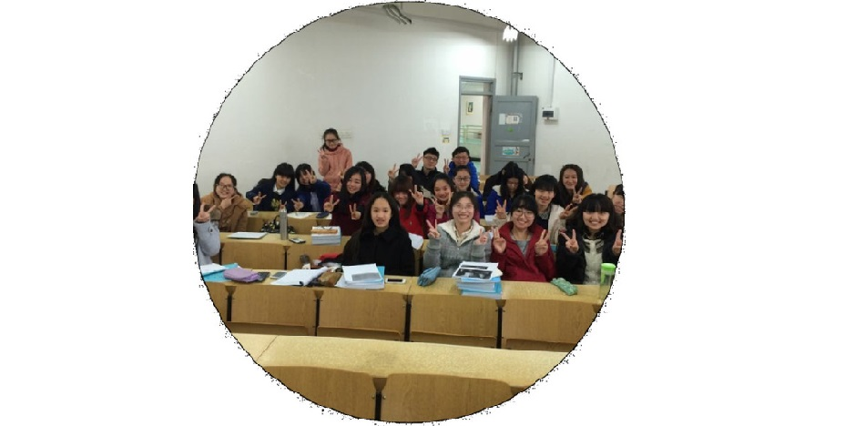

---

permalink: /story/nerd/
title: "Story"

author_profile: true
redirect_from: 
  - /about
---









# The Nerd

During my freshman year, I was a student majoring in Chemical Engineering and Technology. Of course, I didn't like chemistry; I was reassigned to the chemistry major randomly by the system. <i>(Reassignment means that I was admitted to the university, but my entrance exam scores didn't meet the requirements for my preferred major, so I was randomly assigned to a different department with available slots.)</i> 

     <i>1st year of undergraduate in Chemical Engineering and Technology 化学1301班 @ Hunan Unniversity, 2013</i> 

     <i>My Forever Love 4 Roommates, Graduation, Chemical Engineering and Technology 化工1301班 @ Hunan University, 2017</i> 

And after the first year, I transferred to the Accounting major (concentration: the *Association of Chartered Certified Accountants*) at my family's request. Of course, Unfortunately, I didn't enjoy accounting either. I struggled to find my true interests for a very long time.

     <i>My new classmates, though I don't like accounting but my classmates are vey niCe, ACCA1301 @ Hunan University, 2015</i> 

In my final year of undergraduate studies, I participated in the graduate school entrance exams. I underestimated my performance, mistakenly believing my score would fall short of the requirements for my preferred school. Although I ultimately met the threshold, my lack of confidence before the release of the minimum passing score led me to doubt myself. My family, however, was deeply disappointed—not only because they feared I might fail such an important exam but also because they believed I lacked ambition, was overly reliant on them, and struggled to live independently.

To push me toward self-reliance, they gave me ¥8,000 Chinese Yuan (approximately $1,140) and informed me that I would need to support myself from that point forward, as they would no longer provide financial assistance. Believing it was just a stern warning, I left home with the money and began working to make ends meet.

Initially, I assumed their stance was temporary. However, when the money ran out and my phone broke during an audit-related work trip, I reached out to them for financial help—only to be refused. It was then that I realized they were serious about their decision. Feeling both upset and unprepared, I borrowed money from friends and classmates to cover my daily expenses. 

By the time I graduated, I realized I couldn’t repay my debts with the modest salaries typically offered in China. Determined to find a solution, I decided to join China’s Foreign Infrastructure Aid Projects in Africa, which promised at least triple the income I could earn at home. 

This decision marked the beginning of my journey toward financial independence and a new chapter in my life.

<!-- My first work was in Ethiopia, where I worked as a junior accountant for the Kombolcha-Bati-Mille Upgrade Project. Then I went to Kenya, working as an accountant and tax specialist for the Karen Waterfront Shopping Mall Project and Kakamega County General Hospital Project. After gaining comprehensive training in various roles, I joined the China Civil Engineering Construction Corporation Nigeria Limited, where I primarily worked on the Lagos-Ibadan Railway project, along with the Abuja Airport Project and various logistics and real estate projects in Abuja. I stayed in Abeokuta for almost three years, progressing from accountant to assistant financial manager.-->

